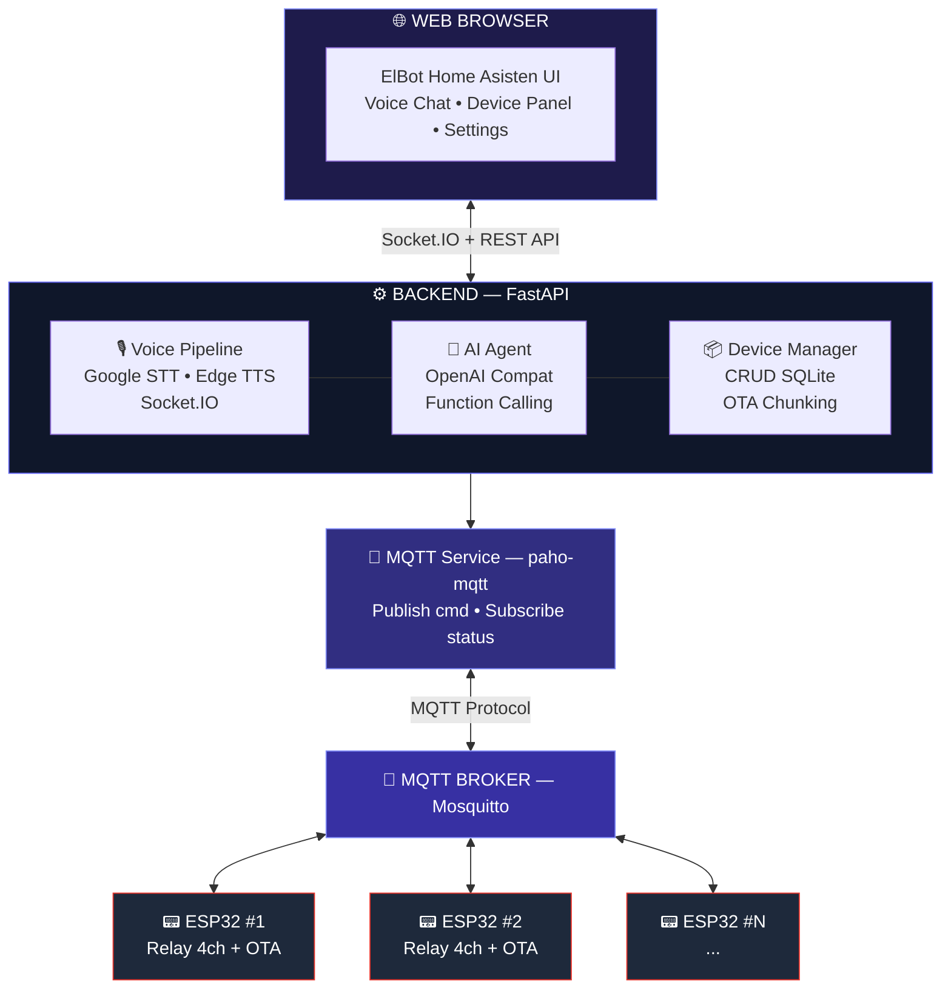
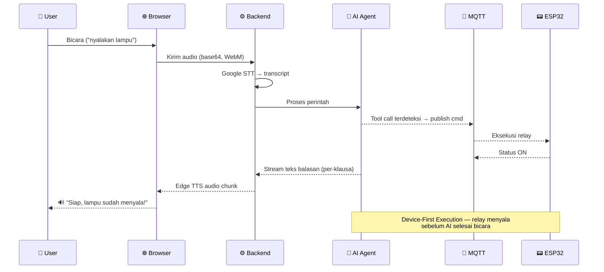

<div align="center">


<a href="#-quick-start">
  
</a>

<br/>

[](https://python.org)
[](https://fastapi.tiangolo.com)
[](https://www.espressif.com)
[](https://mosquitto.org)
[](LICENSE)


</div>

<br/>


## ✨ Fitur Utama

<table>
<tr>
<td width="50%" valign="top">

### 🎙️ Voice Chat Realtime
Bicara langsung ke ElBot — AI memahami perintah Bahasa Indonesia dan merespons dengan suara, tanpa jeda canggung.

### 🤖 AI Agent Cerdas
Menggunakan OpenAI-compatible API dengan *function calling* — ElBot benar-benar **mengeksekusi** perintah, bukan sekadar menjawab teks.

### ⚡ Device-First Execution
Perintah dieksekusi ke perangkat **sebelum** AI selesai menyusun kalimat balasan. Target latensi **< 2 detik**.

### 💡 Kontrol ESP32 via MQTT
Kendalikan relay 4-channel di ESP32 melalui protokol MQTT yang ringan dan reliable.

</td>
<td width="50%" valign="top">

### 🔄 OTA Firmware Update
Upload firmware `.bin` dari web → dikirim via MQTT → ESP32 auto-update tanpa kabel sama sekali.

### 🎨 Dark Mode UI
Tampilan modern bergaya OLED dengan animasi halus dan responsif di semua ukuran layar.

### 🔒 Session Auth
Proteksi akses dengan login password sederhana berbasis bcrypt.

### 📊 Device Dashboard
Pantau status semua perangkat secara realtime di panel cepat, lengkap dengan RSSI & uptime.

</td>
</tr>
</table>


## 🏗️ Arsitektur Sistem




## 🎯 Cara Kerja Voice Chat



**AI Tools yang tersedia:**

| Tool | Fungsi |
|:-----|:-------|
| `control_device` | Nyalakan / matikan / toggle perangkat |
| `get_device_status` | Cek status perangkat saat ini |
| `list_devices` | Lihat semua perangkat terdaftar |


## 🛠️ Tech Stack

<div align="center">


</div>

| Layer | Teknologi |
|:------|:----------|
| **Backend** | Python 3.11+, FastAPI, SQLAlchemy (async), aiosqlite |
| **Realtime** | python-socketio, Socket.IO client |
| **Voice — STT** | Google Speech API v2 + ffmpeg (WebM → FLAC) |
| **Voice — TTS** | Edge TTS (`id-ID-GadisNeural`) |
| **AI Agent** | OpenAI-compatible API, streaming + function calling |
| **IoT Protocol** | MQTT (paho-mqtt + Eclipse Mosquitto) |
| **Database** | SQLite (via aiosqlite, zero-config) |
| **Frontend** | HTML + TailwindCSS + Lucide Icons + Vanilla JS |
| **Firmware** | ESP32 Arduino, PubSubClient, Update.h (OTA) |


## 🚀 Quick Start

### Prasyarat


### 1️⃣ Clone & Setup

```bash
git clone <repository-url>
cd home-asisten

# Buat virtual environment
cd backend
python3 -m venv venv
source venv/bin/activate

# Install dependencies
pip install -r requirements.txt
```

### 2️⃣ Konfigurasi

```bash
cp .env.example .env
# Edit .env dengan konfigurasi kamu
```

<details>
<summary><b>📋 Klik untuk lihat variabel environment penting</b></summary>

<br/>

| Variabel | Deskripsi | Default |
|:---------|:----------|:--------|
| `APP_PASSWORD_HASH` | Hash bcrypt untuk login | *(generate dengan bcrypt)* |
| `SECRET_KEY` | Secret key untuk session | *(random string)* |
| `MQTT_BROKER_HOST` | Alamat MQTT broker | `localhost` |
| `MQTT_BROKER_PORT` | Port MQTT broker | `1883` |
| `AI_API_BASE_URL` | Base URL OpenAI-compatible API | *(required)* |
| `AI_API_KEY` | API key untuk AI | *(required)* |
| `AI_MODEL_NAME` | Nama model AI | *(required)* |
| `GOOGLE_STT_KEY` | Google Speech API key | *(required)* |

</details>

### 3️⃣ Jalankan MQTT Broker

```bash
# Install Mosquitto (jika belum)
sudo apt install mosquitto mosquitto-clients

# Start broker
mosquitto -v
```

### 4️⃣ Jalankan Backend

```bash
cd backend
source venv/bin/activate

uvicorn app.main:app --host 0.0.0.0 --port 8000 --reload
```

> 🌐 Server berjalan di **http://localhost:8000**

### 5️⃣ Flash ESP32 *(opsional)*

1. Buka `firmware/esp32_relay/esp32_relay.ino` di Arduino IDE
2. Sesuaikan konfigurasi WiFi dan MQTT di bagian atas file
3. Upload ke ESP32 via USB
4. ESP32 akan otomatis connect ke broker dan subscribe topic


## 📁 Struktur Proyek

<details>
<summary><b>📂 Klik untuk membuka struktur folder lengkap</b></summary>

```
home-asisten/
├── backend/
│   ├── app/
│   │   ├── main.py                 # FastAPI entry point + Socket.IO wrapper
│   │   ├── config.py               # Pydantic settings dari .env
│   │   ├── auth.py                 # Session-based authentication
│   │   ├── core/
│   │   │   ├── ai_agent.py         # AI orchestrator + streaming + tool calls
│   │   │   ├── stt_service.py      # Google Speech-to-Text
│   │   │   ├── tts_service.py      # Edge Text-to-Speech
│   │   │   └── mqtt_service.py     # MQTT client async wrapper
│   │   ├── chat/
│   │   │   ├── router.py           # Socket.IO event handlers (STT→AI→TTS)
│   │   │   ├── tools.py            # AI tool definitions + system prompt
│   │   │   └── models.py           # Session-only chat models
│   │   ├── devices/
│   │   │   ├── router.py           # REST API device CRUD + control
│   │   │   ├── crud.py             # Async database operations
│   │   │   ├── models.py           # SQLAlchemy models
│   │   │   └── schemas.py          # Pydantic request/response schemas
│   │   ├── db/
│   │   │   ├── database.py         # Async SQLite engine + sessions
│   │   │   └── init_db.py          # Database initialization
│   │   └── ws/
│   │       └── connection_manager.py
│   ├── .env                        # Environment configuration
│   ├── requirements.txt            # Python dependencies
│   └── run.sh                      # Convenience startup script
│
├── frontend/
│   ├── index.html                  # Halaman utama — Voice Chat
│   ├── settings.html               # Pengaturan — Device & Firmware
│   ├── login.html                  # Halaman login
│   └── static/
│       ├── css/styles.css          # Custom animations & theming
│       └── js/
│           ├── app.js              # Chat logic + Socket.IO + mic
│           └── settings.js         # Device CRUD + firmware upload
│
├── firmware/
│   └── esp32_relay/
│       ├── esp32_relay.ino         # Main firmware — WiFi + MQTT + relay
│       └── ota_handler.h           # OTA update via MQTT chunks
│
└── plan-home-asisten.md            # Blueprint proyek lengkap
```

</details>


## 📡 MQTT Topic Convention

| Topic | Arah | Deskripsi |
|:------|:----:|:----------|
| `elbot/{device_id}/cmd` | Backend ➡️ ESP32 | Perintah kontrol relay |
| `elbot/{device_id}/status` | ESP32 ➡️ Backend | Status relay + heartbeat |
| `elbot/{device_id}/lwt` | ESP32 ➡️ Broker | Last Will (online/offline) |
| `elbot/{device_id}/ota/data` | Backend ➡️ ESP32 | Chunk firmware (base64) |
| `elbot/{device_id}/ota/status` | ESP32 ➡️ Backend | Progress OTA update |

<details>
<summary><b>📦 Contoh Payload</b></summary>

**Command** (Backend → ESP32):
```json
{
  "action": "set_state",
  "target": "relay_1",
  "value": "ON"
}
```

**Status** (ESP32 → Backend):
```json
{
  "device_id": "esp32-ruangtamu",
  "relay_1": "ON",
  "relay_2": "OFF",
  "relay_3": "OFF",
  "relay_4": "OFF",
  "rssi": -55,
  "uptime": 13452
}
```

</details>


## 🔌 REST API Endpoints

| Method | Endpoint | Deskripsi |
|:------:|:---------|:----------|
|  | `/api/auth/login` | Login dengan password |
|  | `/api/devices` | Daftar semua perangkat |
|  | `/api/devices` | Tambah perangkat baru |
|  | `/api/devices/{id}` | Detail perangkat |
|  | `/api/devices/{id}` | Update perangkat |
|  | `/api/devices/{id}` | Hapus perangkat |
|  | `/api/devices/{id}/control` | Kontrol relay (ON/OFF/TOGGLE) |
|  | `/api/devices/{id}/firmware` | Upload firmware OTA |
|  | `/api/hello` | API info |
|  | `/health` | Health check + MQTT status |

> 🔒 Semua endpoint `/api/devices/*` dilindungi oleh session authentication.


## ⚡ Optimasi Latensi

<div align="center">

### Target: **&lt; 2 detik** dari user selesai bicara → device menyala + ElBot mulai bicara

</div>

| Strategi | Penjelasan |
|:---------|:-----------|
| 🚀 **Device-First Execution** | Tool call dieksekusi segera saat terdeteksi di stream, tanpa menunggu AI selesai |
| 🔊 **Clause-by-Clause TTS** | Audio mulai diputar per-klausa, tidak menunggu seluruh kalimat |
| 🔗 **Persistent MQTT** | Koneksi tetap terbuka, tidak ada overhead connect/disconnect |
| ⚙️ **Async Throughout** | Semua operasi I/O non-blocking |


## 🔧 ESP32 Firmware

### Wiring Relay 4-Channel

| Relay | GPIO | Fungsi |
|:-----:|:----:|:-------|
| Relay 1 | `GPIO 26` | Channel 1 |
| Relay 2 | `GPIO 25` | Channel 2 |
| Relay 3 | `GPIO 33` | Channel 3 |
| Relay 4 | `GPIO 32` | Channel 4 |

> ⚠️ Relay bersifat **active LOW** — `LOW` = ON, `HIGH` = OFF

### Fitur Firmware

- ✅ Auto-connect WiFi + MQTT saat boot
- ✅ Subscribe ke topic command, eksekusi relay
- ✅ Publish status periodik (heartbeat)
- ✅ Last Will Testament (LWT) untuk deteksi offline
- ✅ OTA update via MQTT (chunked base64, 4KB per chunk)
- ✅ State persistence via Preferences (NVS)


## 🎨 UI Preview

<table>
<tr>
<td width="50%" valign="top">

### 💬 Halaman Chat
- Bubble chat real-time dengan ElBot
- Panel cepat status perangkat (toggle langsung)
- Tombol mikrofon + indikator visual (listening/thinking/speaking)
- Input teks alternatif

</td>
<td width="50%" valign="top">

### ⚙️ Halaman Settings
- **Tab Perangkat** — CRUD device, toggle manual ON/OFF
- **Tab Firmware** — Upload `.bin` dengan progress bar
- **Tab Umum** — Konfigurasi sistem

</td>
</tr>
</table>


## 📦 Dependencies

<details>
<summary><b>🐍 Backend (Python)</b></summary>

<br/>

| Package | Versi | Kegunaan |
|:--------|:------|:---------|
| fastapi | 0.115.0 | Web framework |
| uvicorn | 0.32.0 | ASGI server |
| sqlalchemy | 2.0.36 | ORM (async) |
| aiosqlite | 0.20.0 | Async SQLite driver |
| python-socketio | 5.12.1 | Realtime Socket.IO server |
| paho-mqtt | 2.1.0 | MQTT client |
| edge-tts | 6.1.14 | Free TTS (Indonesian) |
| openai | 1.68.0 | OpenAI-compatible SDK |
| passlib | 1.7.4 | Password hashing (bcrypt) |

</details>

<details>
<summary><b>📟 Firmware (ESP32)</b></summary>

<br/>

| Library | Kegunaan |
|:--------|:---------|
| WiFi.h | Koneksi WiFi |
| PubSubClient | MQTT client |
| ArduinoJson | Parse JSON payload |
| Update.h | OTA firmware flashing |
| Preferences.h | State persistence (NVS) |

</details>


## 🐛 Troubleshooting

| Masalah | Solusi |
|:--------|:-------|
| ❌ MQTT connection refused | Pastikan Mosquitto berjalan: `mosquitto -v` |
| ❌ STT tidak mengenali suara | Cek ffmpeg terinstall: `ffmpeg -version` |
| ❌ ESP32 tidak connect | Periksa SSID/password WiFi di firmware |
| ❌ Audio TTS tidak keluar | Pastikan browser mengizinkan autoplay audio |
| ❌ Login gagal | Regenerate password hash: `python -c "from passlib.context import CryptContext; print(CryptContext(['bcrypt']).hash('password'))"` |


## 📝 License

Proyek ini menggunakan **MIT License** — bebas digunakan dan dimodifikasi.

<br/>

<div align="center">


*ElBot — Asisten rumah pintar yang selalu siap membantu.*

</div>